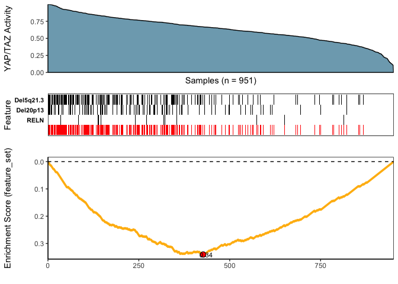

<!-- README.md is generated from README.Rmd. Please edit the this Rmd file -->

Candidate Drivers Analysis: Multi-Omic Search for Candidate Drivers of
Functional Signatures

**CaDrA** is an R package that supports a heuristic search framework
aimed at identifying candidate drivers of a molecular phenotype of
interest.

The main function takes two inputs:

1.  A binary multi-omics dataset represented as a
    **SummarizedExperiment** class object (where the rows are 1/0
    vectors indicating the presence/absence of ‘omics’ features such as
    somatic mutations, copy number alterations, epigenetic marks, etc.,
    and the columns represent the samples)

2.  A molecular phenotype represented as a vector of continuous scores
    (sample-specific scores representing a phenotypic readout of
    interest, such as protein expression, pathway activity, etc.).

Based on this input, **CaDrA** implements a forward/backward search
algorithm to find the set of features that together is maximally
associated with the observed input scores, based on one of several
scoring functions (*Kolmogorov-Smirnov*, *Conditional Mutual
Information*, *Wilcoxon*, *custom-defined scoring function*), making it
useful to find complementary omics features likely driving the input
molecular phenotype.

For more information, please see the associated manuscript [Kartha et
al. (2019)](https://www.frontiersin.org/articles/10.3389/fgene.2019.00121/full)

## (1) Installation

    library(devtools)
    devtools::install_github("montilab/CaDrA")

## (2) Quickstart

    library(CaDrA)
    library(SummarizedExperiment)

## (3) CaDrA Query of BRCA YAP/TAZ Activity

### (i) Load & Format Data Inputs

    ## Read in BRCA GISTIC+Mutation object
    data(BRCA_GISTIC_MUT_SIG)
    eset_mut_scna <- BRCA_GISTIC_MUT_SIG

    ## Read in input score
    data(TAZYAP_BRCA_ACTIVITY)
    input_score <- TAZYAP_BRCA_ACTIVITY

    ## Samples to keep based on the overlap between the two inputs
    overlap <- intersect(names(input_score), colnames(eset_mut_scna))
    eset_mut_scna <- eset_mut_scna[,overlap]
    input_score <- input_score[overlap]

    ## Binarize FS to only have 0's and 1's
    assay(eset_mut_scna)[assay(eset_mut_scna) > 1] <- 1.0

    ## Pre-filter FS based on occurrence frequency
    eset_mut_scna_flt <- CaDrA::prefilter_data(
      FS = eset_mut_scna,
      max_cutoff = 0.6,  # max event frequency (60%)
      min_cutoff = 0.03  # min event frequency (3%)
    )  

### (ii) Run CaDrA

Here, we repeat the candidate search starting from each of the top ‘N’
features and report the combined results as a heatmap (to summarize the
number of times each feature is selected across repeated runs).

IMPORTANT NOTE: The legacy function `topn_eval()` is equivalent to the
recommended `candidate_search()` function

    topn_res <- CaDrA::candidate_search(
      FS = eset_mut_scna_flt,
      input_score = input_score,
      method = "ks_pval",          # Use Kolmogorow-Smirnow scoring function 
      weight = NULL,               # If weights is provided, perform a weighted-KS test
      alternative = "less",        # Use one-sided hypothesis testing
      search_method = "both",      # Apply both forward and backward search
      top_N = 7,                   # Evaluate top 7 starting points for each search
      max_size = 7,                # Maximum size a meta-feature matrix can extend to
      do_plot = FALSE,             # Plot after finding the best features
      best_score_only = FALSE      # Return meta-feature set, observed input scores and calculated best score
    )

### (iii) Visualize Best Results

    ## Fetch the meta-feature set corresponding to its best scores over top N features searches
    topn_best_meta <- CaDrA::topn_best(topn_res)

    # Visualize the best results with the meta-feature plot
    CaDrA::meta_plot(topn_best_list = topn_best_meta, input_score_label = "YAP/TAZ Activity")

### (iv) Summarize Top N Results

    # Evaluate results across top N features you started from
    CaDrA::topn_plot(topn_res) 

## (4) SessionInfo

    sessionInfo()
    R version 4.2.3 (2023-03-15)
    Platform: x86_64-pc-linux-gnu (64-bit)
    Running under: Ubuntu 22.04.2 LTS

    Matrix products: default
    BLAS:   /usr/lib/x86_64-linux-gnu/openblas-pthread/libblas.so.3
    LAPACK: /usr/lib/x86_64-linux-gnu/openblas-pthread/libopenblasp-r0.3.20.so

    locale:
     [1] LC_CTYPE=C.UTF-8       LC_NUMERIC=C           LC_TIME=C.UTF-8       
     [4] LC_COLLATE=C.UTF-8     LC_MONETARY=C.UTF-8    LC_MESSAGES=C.UTF-8   
     [7] LC_PAPER=C.UTF-8       LC_NAME=C              LC_ADDRESS=C          
    [10] LC_TELEPHONE=C         LC_MEASUREMENT=C.UTF-8 LC_IDENTIFICATION=C   

    attached base packages:
    [1] stats4    stats     graphics  grDevices utils     datasets  methods  
    [8] base     

    other attached packages:
     [1] CaDrA_0.99.2                SummarizedExperiment_1.28.0
     [3] Biobase_2.58.0              GenomicRanges_1.50.2       
     [5] GenomeInfoDb_1.34.9         IRanges_2.32.0             
     [7] S4Vectors_0.36.2            BiocGenerics_0.44.0        
     [9] MatrixGenerics_1.10.0       matrixStats_0.63.0         

    loaded via a namespace (and not attached):
     [1] Rcpp_1.0.10            lattice_0.20-45        gtools_3.9.4          
     [4] digest_0.6.31          foreach_1.5.2          utf8_1.2.3            
     [7] R6_2.5.1               plyr_1.8.8             evaluate_0.20         
    [10] highr_0.10             ggplot2_3.4.1          pillar_1.8.1          
    [13] gplots_3.1.3           zlibbioc_1.44.0        rlang_1.1.0           
    [16] misc3d_0.9-1           R.utils_2.12.2         R.oo_1.25.0           
    [19] Matrix_1.5-3           rmarkdown_2.20         labeling_0.4.2        
    [22] stringr_1.5.0          RCurl_1.98-1.10        munsell_0.5.0         
    [25] DelayedArray_0.24.0    compiler_4.2.3         xfun_0.37             
    [28] pkgconfig_2.0.3        htmltools_0.5.4        tcltk_4.2.3           
    [31] tibble_3.2.0           GenomeInfoDbData_1.2.9 ppcor_1.1             
    [34] codetools_0.2-19       fansi_1.0.4            withr_2.5.0           
    [37] MASS_7.3-58.2          bitops_1.0-7           R.methodsS3_1.8.2     
    [40] grid_4.2.3             gtable_0.3.1           lifecycle_1.0.3       
    [43] magrittr_2.0.3         scales_1.2.1           KernSmooth_2.23-20    
    [46] cli_3.6.0              stringi_1.7.12         farver_2.1.1          
    [49] XVector_0.38.0         reshape2_1.4.4         doParallel_1.0.17     
    [52] vctrs_0.6.0            iterators_1.0.14       tools_4.2.3           
    [55] R.cache_0.16.0         glue_1.6.2             parallel_4.2.3        
    [58] fastmap_1.1.1          yaml_2.3.7             colorspace_2.1-0      
    [61] caTools_1.18.2         knitr_1.42            
