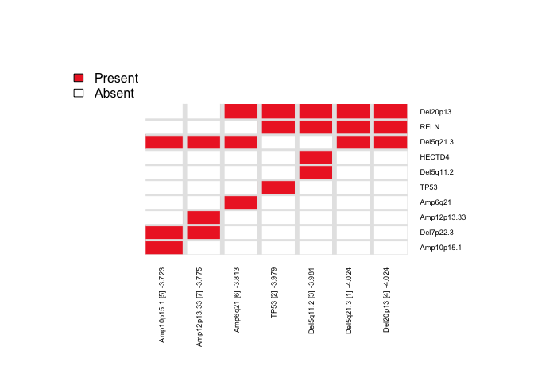

CaDrA
================

<!-- README.md is generated from README.Rmd. Please edit that file -->
<!-- badges: start -->
<!-- [](https://github.com/montilab/CaDrA/actions) -->
<!-- badges: end -->

Candidate Drivers Analysis: Multi-Omic Search for Candidate Drivers of
Functional Signatures

**CaDrA** is an R package that supports a heuristic search framework
aimed at identifying candidate drivers of a molecular phenotype of
interest.

The main function takes two inputs:

1)  A binary multi-omics dataset represented as a
    **SummarizedExperiment** class object (where the rows are 1/0
    vectors indicating the presence/absence of ‘omics’ features such as
    somatic mutations, copy number alterations, epigenetic marks, etc.,
    and the columns represent the samples)

2)  A molecular phenotype represented as a vector of continuous scores
    (sample-specific scores representing a phenotypic readout of
    interest, such as protein expression, pathway activity, etc.).

Based on this input, **CaDrA** implements a forward/backward search
algorithm to find the set of features that together is maximally
associated with the observed input scores, based on one of several
scoring functions (*Kolmogorov-Smirnov*, *Conditional Mutual
Information*, *Wilcoxon*, *custom-defined scoring function*), making it
useful to find complementary omics features likely driving the input
molecular phenotype.

For more information, please see the associated manuscript [Kartha et
al. (2019)](https://www.frontiersin.org/articles/10.3389/fgene.2019.00121/full)

## (1) Installation

``` r
library(devtools)
devtools::install_github("montilab/CaDrA")
```

## (2) Quickstart

``` r
library(CaDrA)
library(SummarizedExperiment)
```

## (3) CaDrA Query of BRCA YAP/TAZ Activity

### (i) Load & Format Data Inputs

``` r

## Read in BRCA GISTIC+Mutation object
data(BRCA_GISTIC_MUT_SIG)
eset_mut_scna <- BRCA_GISTIC_MUT_SIG

## Read in input score
data(TAZYAP_BRCA_ACTIVITY)
input_score <- TAZYAP_BRCA_ACTIVITY

## Samples to keep based on the overlap between the two inputs
overlap <- intersect(names(input_score), colnames(eset_mut_scna))
eset_mut_scna <- eset_mut_scna[,overlap]
input_score <- input_score[overlap]

## Binarize FS to only have 0's and 1's
assay(eset_mut_scna)[assay(eset_mut_scna) > 1] <- 1.0

## Pre-filter FS based on occurrence frequency
eset_mut_scna_flt <- CaDrA::prefilter_data(
  FS = eset_mut_scna,
  max_cutoff = 0.6,  # max event frequency (60%)
  min_cutoff = 0.03  # min event frequency (3%)
)  
```

### (ii) Run CaDrA

Here, we repeat the candidate search starting from each of the top ‘N’
features and report the combined results as a heatmap (to summarize the
number of times each feature is selected across repeated runs).

IMPORTANT NOTE: The legacy function `topn_eval()` is equivalent to the
recommended `candidate_search()` function

``` r

topn_res <- CaDrA::candidate_search(
  FS = eset_mut_scna_flt,
  input_score = input_score,
  method = "ks",               # Use Kolmogorow-Smirnow scoring function 
  weight = NULL,               # If weights is provided, perform a weighted-KS test
  alternative = "less",        # Use one-sided hypothesis testing
  metric = "pval",             # Use p-value to search for best features
  search_method = "both",      # Apply both forward and backward search
  top_N = 7,                   # Evaluate top 7 starting points for each search
  max_size = 7,                # Maximum size a meta-feature matrix can extend to
  do_plot = FALSE,             # Plot after finding the best features
  best_score_only = FALSE      # Return meta-feature set, observed input scores and calculated best score
)
```

### (iii) Visualize Best Results

``` r

## Fetch the meta-feature set corresponding to its best scores over top N features searches
topn_best_meta <- CaDrA::topn_best(topn_res)

# Visualize the best results with the meta-feature plot
CaDrA::meta_plot(topn_best_list = topn_best_meta, input_score_label = "YAP/TAZ Activity")
```

<!-- -->

### (iv) Summarize Top N Results

``` r

# Evaluate results across top N features you started from
CaDrA::topn_plot(topn_res) 
```

<!-- -->

## (4) SessionInfo

``` r
sessionInfo()
R version 4.2.2 (2022-10-31)
Platform: x86_64-apple-darwin17.0 (64-bit)
Running under: macOS Big Sur ... 10.16

Matrix products: default
BLAS:   /Library/Frameworks/R.framework/Versions/4.2/Resources/lib/libRblas.0.dylib
LAPACK: /Library/Frameworks/R.framework/Versions/4.2/Resources/lib/libRlapack.dylib

locale:
[1] en_US.UTF-8/en_US.UTF-8/en_US.UTF-8/C/en_US.UTF-8/en_US.UTF-8

attached base packages:
[1] stats4    stats     graphics  grDevices utils     datasets  methods  
[8] base     

other attached packages:
 [1] SummarizedExperiment_1.28.0 Biobase_2.58.0             
 [3] GenomicRanges_1.50.2        GenomeInfoDb_1.34.4        
 [5] IRanges_2.32.0              S4Vectors_0.36.1           
 [7] BiocGenerics_0.44.0         MatrixGenerics_1.10.0      
 [9] matrixStats_0.63.0          CaDrA_0.99.2               

loaded via a namespace (and not attached):
 [1] Rcpp_1.0.9             lattice_0.20-45        gtools_3.9.4          
 [4] assertthat_0.2.1       digest_0.6.31          foreach_1.5.2         
 [7] utf8_1.2.2             R6_2.5.1               plyr_1.8.8            
[10] evaluate_0.19          highr_0.9              ggplot2_3.4.0         
[13] pillar_1.8.1           gplots_3.1.3           zlibbioc_1.44.0       
[16] rlang_1.0.6            misc3d_0.9-1           rstudioapi_0.14       
[19] R.utils_2.12.2         R.oo_1.25.0            Matrix_1.5-3          
[22] rmarkdown_2.19         labeling_0.4.2         stringr_1.5.0         
[25] RCurl_1.98-1.9         munsell_0.5.0          DelayedArray_0.24.0   
[28] compiler_4.2.2         xfun_0.35              pkgconfig_2.0.3       
[31] tcltk_4.2.2            htmltools_0.5.4        tidyselect_1.2.0      
[34] tibble_3.1.8           GenomeInfoDbData_1.2.9 ppcor_1.1             
[37] codetools_0.2-18       fansi_1.0.3            withr_2.5.0           
[40] dplyr_1.0.10           MASS_7.3-58.1          bitops_1.0-7          
[43] R.methodsS3_1.8.2      grid_4.2.2             gtable_0.3.1          
[46] lifecycle_1.0.3        DBI_1.1.3              magrittr_2.0.3        
[49] scales_1.2.1           KernSmooth_2.23-20     cli_3.4.1             
[52] stringi_1.7.8          farver_2.1.1           XVector_0.38.0        
[55] reshape2_1.4.4         doParallel_1.0.17      generics_0.1.3        
[58] vctrs_0.5.1            iterators_1.0.14       tools_4.2.2           
[61] R.cache_0.16.0         glue_1.6.2             parallel_4.2.2        
[64] fastmap_1.1.0          yaml_2.3.6             colorspace_2.0-3      
[67] caTools_1.18.2         knitr_1.41            
```
